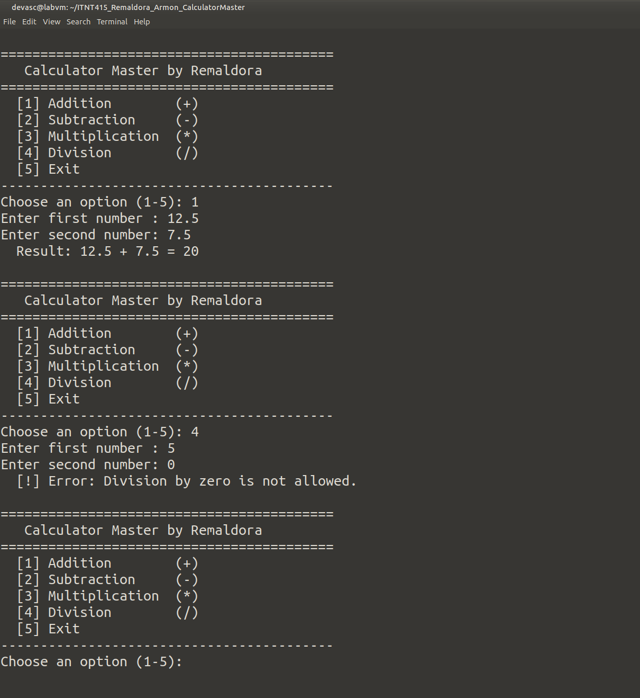

# ITNT415_Remaldora_Armon_CalculatorMaster

- **Student Name:** Armon Jhon M. Remaldora
- **Course and Section:** S-ITNT415 - BIT41
- **Assessment:** Midterm Summative Assessment - Calculator Master

## Project Description
Calculator Master is a menu-driven Python calculator built with Git and GitHub.
Each math operation was developed on its own feature branch, reviewed through a
Pull Request, and merged into `main`, so the final version integrates all four
operations into one application.

## Branch Structure
| Branch | Purpose |
|---|---|
| `main` | Calculator skeleton (menu, input validation, main loop) and the final integrated app |
| `addition_Remaldora` | Addition operation |
| `subtraction_Remaldora` | Subtraction operation |
| `multiplication_Remaldora` | Multiplication operation |
| `division_Remaldora` | Division operation with division-by-zero handling |

## Program Features
- Menu-driven interface (options 1-5)
- Runs continuously until the user chooses **5 - Exit**
- One function per operation: `add()`, `subtract()`, `multiply()`, `divide()`
- Input validation: non-numeric input is rejected and the user is asked again
- Invalid menu choices are caught and explained
- Division-by-zero handling with a clear error message
- Clean output (whole numbers print without `.0`, float noise such as `0.1 + 0.2` is rounded)

## How to Run
```bash
python3 calculator.py
```

## Sample Execution Screenshot
Final program on `main` after all four feature branches were merged (addition 12.5 + 7.5 and the division-by-zero check):


